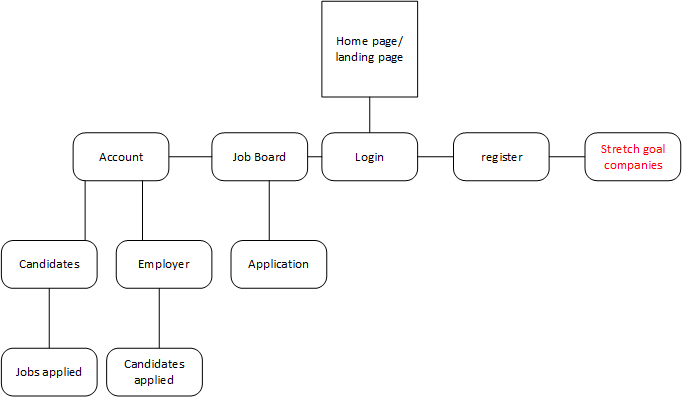
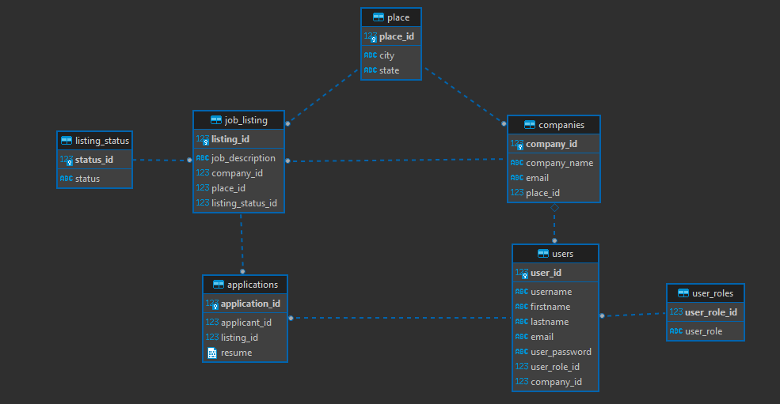
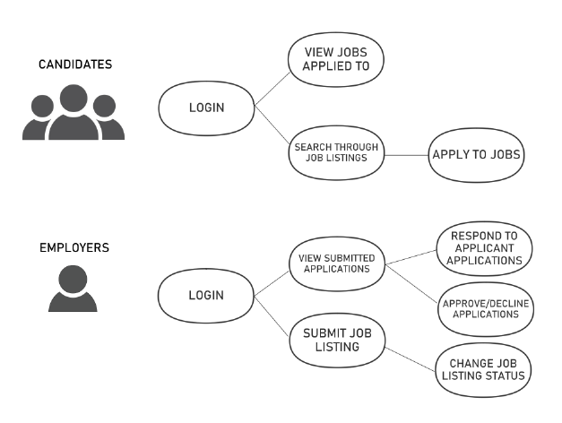

# Job Board Website 
> This application is a job board website with a back-end and a front-end built with a Spring framwork in java. The application is also a Resftful API that will allow employers and candidates to login, view and manage job posts on the website.

## User Stores 
### Candidates: 
- Users can register for an account.
- Users can login into their accounts
- Users can submit an application for a job posting
- Users can cancel an application
- Users can filter by job posts(ex by location, title,position) 
- Users can view status of submitted application (pending, approved, denied)

### Employers:
- Employers can post job ads
- Employers can view submitted applications
- Employers can take down ad after position is filled
- Employers can contact employees who have submitted applications
- Employers can update status of application (mark interested or uninterested)

## Flowcharts
**Web-Page Flowchart** 
 

 

**ERD**
 

 

**Use Case Diagram**
 

 

## Tech stack 
- [ ] PostgreSQL for persistence
- [ ] API built with Java 8 and Spring 5
- [ ] UI built with HTML, CSS, and JavaScript
- [ ] Git SCM (hosted on GitHub)
- [ ] Testing built using JUnit & Mockito

## Technology framework 
- [ ] Java API will leverage the Spring Framework
- [ ] Java API will use Spring Data JPA to communicate with the DB
- [ ] Java API will be RESTful (though HttpSession will be permitted)
- [ ] Java API will be unit tested using JUnit and Mockito

